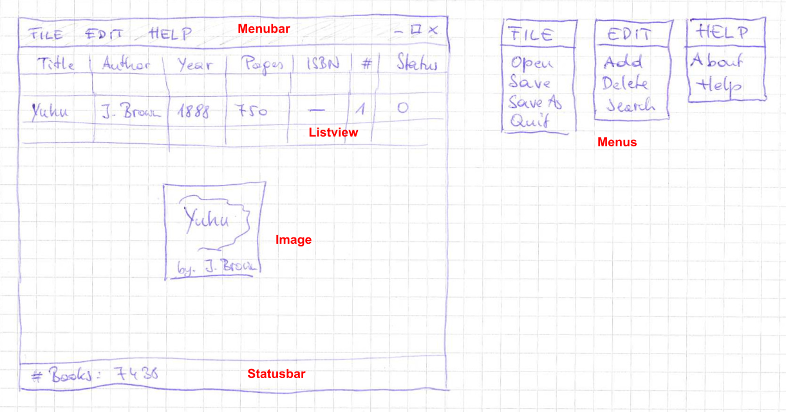
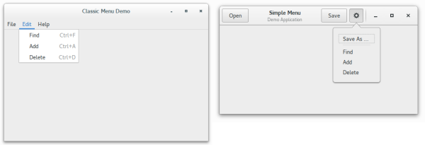
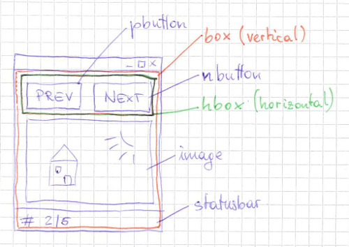
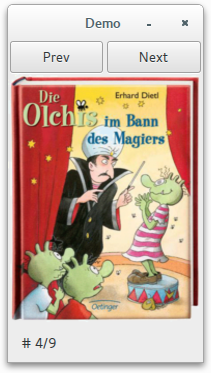
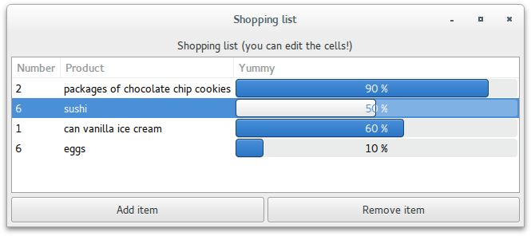
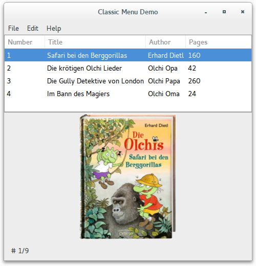
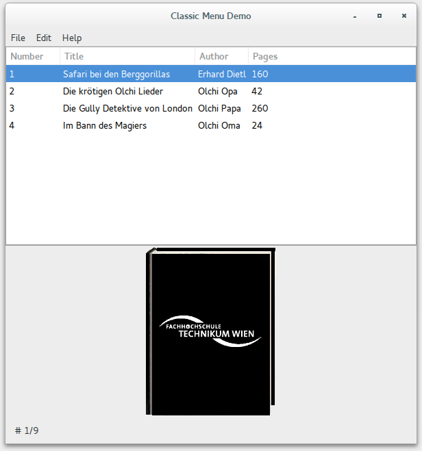
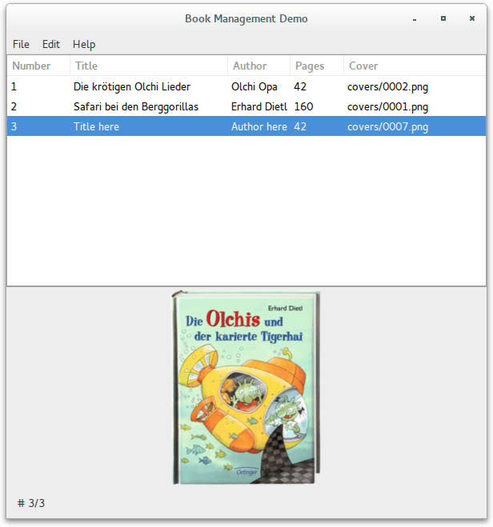
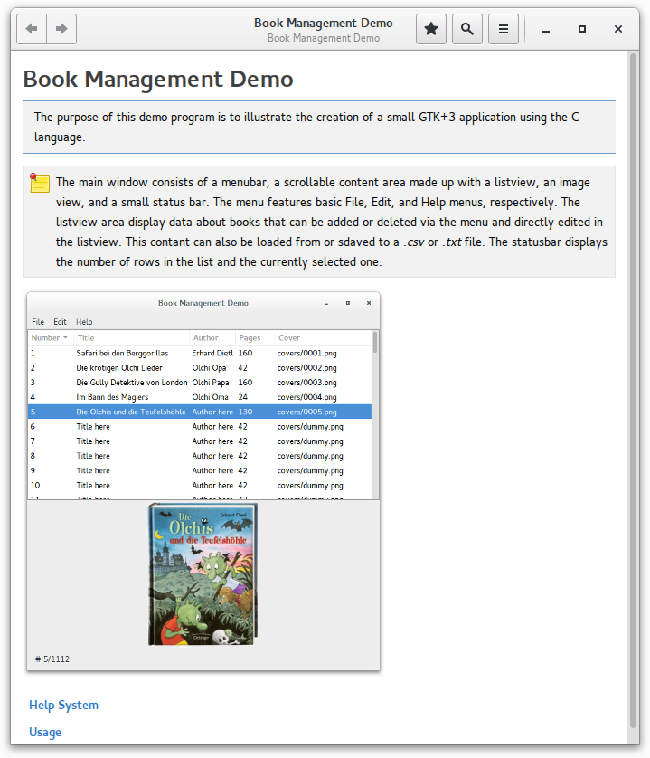
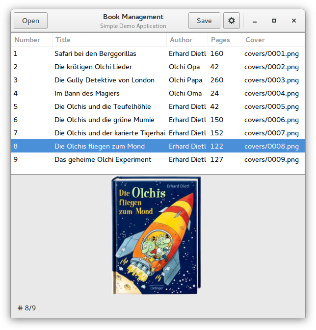

////////////////////////////////////////////////////////////////////////////////
Build: asciidoctor notes.asciidoc
Author: M. Horauer
////////////////////////////////////////////////////////////////////////////////

Book Management Demo
====================
:title: BEL2 SUA
:description: Linux/Unix System Programming, Network Programming, Python, Graphical User Interfaces
:footer: Martin Horauer
:brand: UAS Technikum Wien
:doctype: book
:toc: right
:icons: font
:nofooter:
:source-highlighter: pygments

About
-----

The following steps aim at illustrating how to create a simple program using a graphical user interface - in this case a *book management demo* program. All functions and files will get their own namespace using a `bmd_` prefix.

Relavant links:

* https://developer.gnome.org/gnome-devel-demos/unstable/c.html.en[GNOME Platform Demos]
* gtk3-demo (from GTK+ sources) - see link:recipe.html[recipe] howto make one of the demos standalone

TIP: The code examples make use of a `Makefile` instead of the usual _autotools_ and do not use translations using the typical `gettext()` approach. For code beautification _astyle_ is used.

Step 0 - Mockup
---------------

Step 1 - Menu Demo
------------------

Start using link:01_bmd_classicmenu.tar.gz[Classic Menu] and/or link:02_bmd_gnomemenu.tar.gz[GNOME Menu] and modify the code to match the menu structure of the above menu mockup.

NOTE: The keyboard accelerators of the above examples require GTK+ version >= 3.12. Use `pkg-config --modversion gtk+-3.0` to determine the installed version. For older versions there is `gtk_application_add_accelerator()` -- this function, however, is marked deprecated in newer releases.

TIP: Checkout the `Menu` code/implementation from `gtk3-demo` or the https://developer.gnome.org/gnome-devel-demos/unstable/menubar.c.html.en[menubar] demo from developer.gnome.org -- the `menubar.ui` file can be found along the Python implementation.

Step 2 - Statusbar & Image Demo
-------------------------------

Implement a simple demo program that tests the usage of an image and a statusbar. In particular, the program shall consist of two buttons, an image and a statusbar. The buttons shall allow to cycle (either forward or backward) among a given (hardcoded) set of images. The statusbar shall display, e.g., the index of the current image and the total number of coded images. The implementation shall follow the following mockup.

. Start using link:hello_gtk_v1.c[hello_gtk_v1.c] - remove all unnecessary code from the `activate()` callback function.
. Construct the layout as depicted above using the following function calls within the `activate()` callback.
+
[source,c]
----
gtk_box_new()                   // to create the box layout containers
gtk_box_pack_start()            // to pack widgets into layout containers
gtk_button_new()                // to create the buttons
g_signal_connect()              // to connect signals associated with widgets to callbacks
gtk_image_new_from_file()       // to create the image
gtk_statusbar_new()             // to create the statusbar
gtk_statusbar_get_context_id()  // mandatory to push messages to the statusbar
gtk_statusbar_push()            // push a message to the statusbar
----
+
. Create the callbacks for the `PREV` and `NEXT` buttons. You'll need the following functions:
+
[source,c]
----
gtk_image_set_from_file()       // load a new image overwriting the old one
gtk_statusbar_push()            // push a message onto the statusbar
----

The link:04_bmd_image_statusbar.tar.gz[code] shows the solution of this task.

Step 3 - Listview
-----------------

Next, we construct a listview demo. Fortunately, there is a suitable demo within the `gtk3-demo` program, in particular _Tree View -> Editable Cells_. You can either copy the source-code directly from the `gtk3-demo` program or grab it online from the https://github.com/GNOME/gtk/blob/master/demos/gtk-demo/editable_cells.c[github] repository. Use option 1 of the link:recipe.html[recipe] above to make it standalone.

Simply put - grab the code and add the following code at the end.

[source,c]
----
/* code added */
int
main(int argc, char **argv)
{
    GtkWidget *window;

    gtk_init(&argc, &argv);
    window = do_editable_cells(NULL);
    g_signal_connect(window, "destroy", G_CALLBACK(gtk_main_quit), NULL);
    gtk_main();
    return 0;
}
/*! EOF */
----

[NOTE]
When executing the program from the command-line, you'll notice some warnings (see below). In order to get rid of them remove the function `gtk_window_set_screen()` and rebuild the program.

....
(editable_cells:4881): Gtk-CRITICAL **: gtk_widget_get_screen: assertion 'GTK_IS_WIDGET (widget)' failed

(editable_cells:4881): Gtk-CRITICAL **: gtk_window_set_screen: assertion 'GDK_IS_SCREEN (screen)' failed
....

[red]#*TASK:* Modify the code so that the columns and functionality resemble the one shown in the mockup for the book-management program. To that end, go through the code and modify it accordingly.#

You can find the solution to this task link:05_bmd_editable_cells_v1.tar.gz[here] - check the comments at the top of the file for all the changes done.

[red]#*TASK:* Add _sort_ functionality to the above code. Determine how it is done in the *List Store* example of the gtk3-demo program and try to find a solution
for our purposes.#

You can find the solution to this task link:05_bmd_editable_cells_v2.tar.gz[here] - check the last comments at the top of the file for all the changes done.

Step 4 - Integration
--------------------

In order to integrate all the functionality we'll need to do the following steps:

Step 4a - Preparation
~~~~~~~~~~~~~~~~~~~~~
  
. Remove global variables as done in the menu demo program (we need to do this for image_statusbar and listview).
. Turn the listview demo into a GtkApplication (copy the `main()` from menudemo and adjust some functions in the bmd_activate callback)
. Move construction of the inner "relevant" window layout to a separate function (as done in the menu demo above) and invoke the function
. Move all callback functions for relevant widgets (buttons, etc.) to separate `XXX_callbacks.c` files and add suitable header files. (For the menu files this was already done before.)
. Add function prototypes for all `bmd_construct_XXX()` functions in their associated header files.
. Test all 3 modified programs once more

[NOTE]
When moving callback functions to separate files - you'll eventually need to remove the +static+ keyword in front of functions. Remember, static functions are only accessible from within the same file.

Solution - see link:06_bmd_preparation.tar.gz[here].

Step 4b - Integration
~~~~~~~~~~~~~~~~~~~~~

In order to integrate the three separate programs to a single one we add the following function calls to the 
file `classicmenu.c`:
  
[source,c]
----
  bmd_construct_menu(app, (gpointer)a);
  bmd_construct_editablecells(app, (gpointer)a);
  bmd_construct_imagedemo(app, (gpointer)a);
----

NOTE: The second parameter was moved into the global structure since both a `box` and a `paned` layout container were used to place the widgets. Furthermore, the buttons below the listview were removed.

Next, we modify the type declaration for `bmd_widgets` in `bmd_classicmenu.h` and remove it from the other header files: 

[source,c]
----
typedef struct {
  GtkApplication *app;
  GtkWidget *window;
  GtkWidget *box;
  GtkWidget *paned;
  GtkWidget *image; 
  GtkWidget *statusbar;
} bmd_widgets;
----

Now, include `bmd_classicmenu.h` in the other header files `bmd_editable_cells.h` and `bmd_image_statusbar.h`. Build and run your project - checkout the modified code once more link:07_bmd_integration_v1.tar.gz[here].

Step 4c - Merging Callbacks & Re-Structuring
~~~~~~~~~~~~~~~~~~~~~~~~~~~~~~~~~~~~~~~~~~~~

Removing the buttons was rather simple - merging the callbacks, however, requires access to the `bmd_treeview`, `bmd_items_model` and `bmd_numbers_model` elements. Thus, we add it to the `bmd_widgets` structure in `bmd_classicmenu.h`. 
Next, we replace the dialogs in `bmd_menucallbacks.c` with function calls to `bmd_add_item()` and `bmd_remove_item()` - don't forget to include the `bmd_editable_cells_callbacks.h` header file.

Since, we have moved the declaration of `bmd_treeview`, `bmd_items_model` and `bmd_numbers_model` to the global structure, we can also modify the parameters of the function `bmd_add_columns()`. First we edit `bmd_editable_cells.c` - we prefix all `bmd_treeview`, `bmd_items_model` and `bmd_numbers_model` instances with `a->`. Then, we modify `bmd_editable_cells.h` so that the prototype reflects the prototype in the C file. Finally, we modify the function `bmd_add_columns()` in the file `bmd_editable_cells_callbacks.c` itself. Changed, the parameters and obtain the pointer to our struct within the code and adjust all instances of the respective structs elements so that everything works again. Since all the `g_signal_connect()` functions pass `bmd_items_model` as user parameter, we can modify them to pass a pointer to the entire struct rather than only one parameter. Hence, we replace all:
  
....
  g_signal_connect (renderer, "edited",
                    G_CALLBACK (bmd_cell_edited), items_model);
....

with 

....
  g_signal_connect (renderer, "edited",
                    G_CALLBACK (bmd_cell_edited), (gpointer)a);
....

When done correctly the program will build and execute - testing the functionality to add/remove items, however, will break the program execution, hence, some fixes in the functions `bmd_add_item()` and `bmd_remove_item()` are necessary. Fortunately, the fixes are rather simple. We are passing throughout our program now a pointer resembling our global structure rather than pointer to individual elements. Hence, we replace:
  
....
  GtkTreeView *treeview = (GtkTreeView *)data;
....

with 

....
  bmd_widgets *a = (bmd_widgets *) data;
  GtkTreeView *treeview = (GtkTreeView *)a->treeview;
....

Now, everything should work again checkout the code link:07_bmd_integration_v2.tar.gz[here].

Step 4d - Code Cleanup & Polishing
~~~~~~~~~~~~~~~~~~~~~~~~~~~~~~~~~~

Before, we add the final functionality, we should get familiar and eventually remove code that is not required for the application and identify functions that are missing. When looking at the code for the listview in the file `bmd_editable_cells.c` there are two +models+ named `bmd_numbers_model` and `bmd_items_model`; in fact only the latter will be required. Hence, we can strip all functionality related to `numbers_model` from the source code, in particular, `bmd_editable_cells.c/.h` and `bmd_editable_cells_callbacks.c/.h`. Furthermore, all comments and excluded code will be removed (the one using `#if STANDALONE`, etc.). From the file `bmd_editable_Cells_callbacks.c/.h` the function `bmd_create_numbers_model()` is such a candidate for removal. Furthermore, the files `bmd_image_statusbar_callbacks.c/.h` can be removed - although the code will be required later-on.

Next, we tweak the size of the program and the layout containers to optimize the look-and-feel after program startup (adjust the window size in `bmd_classicmenu.c` and add `gtk_widget_set_size_request()` for the scroll and image containers - checkout the resulting code once more link:07_bmd_integration_v3.tar.gz[here].

Step 4e - Image Filename Columns
~~~~~~~~~~~~~~~~~~~~~~~~~~~~~~~~

In a next step we add a column for the image filenames and update the code displayed on the statusbar. To that end, we need to edit the files `bmd_image_statusbar.c/.h` and `bmd_editable_cells_callbacks.c/.h`, checkout the modified files link:07_bmd_integration_v4.tar.gz[here].

Now, the statusbar gets updated, whenever rows are added or removed.

Step 4f - Add a File - Open Dialog
~~~~~~~~~~~~~~~~~~~~~~~~~~~~~~~~~~

TIP: Check out https://developer.gnome.org/gnome-devel-demos/unstable/image-viewer.c.html.en[the imageviewer demo] for a file chooser dialog.

In the next step we add a filechooser dialog for the File -> Open menu. To that end, we edit the file `bmd_menucallbacks.c` and add the following code to the `bmd_open_callback()` callback function.

[source,c]
----
void
bmd_open_callback (GSimpleAction *action, GVariant *parameter, gpointer data)
{
  gchar *filename;
  bmd_widgets *a = (bmd_widgets *) data;

  GtkFileFilter *filter = gtk_file_filter_new();
  GtkWidget *dialog = gtk_file_chooser_dialog_new("Open library",
                                                  GTK_WINDOW (a->window),
                                                  GTK_FILE_CHOOSER_ACTION_OPEN,
                                                  "_OK", GTK_RESPONSE_ACCEPT,
                                                  "_Cancel", GTK_RESPONSE_CANCEL,
                                                  NULL);
  gtk_file_filter_set_name (filter, "*.csv, *.txt");
  // I used "xdg-mime query default application/csv" to determine whether a CSV
  // mime-type is available
  gtk_file_filter_add_mime_type(filter, "text/csv");
  gtk_file_filter_add_mime_type(filter, "application/csv");
  gtk_file_filter_add_mime_type(filter, "text/x-csv");
  gtk_file_filter_add_mime_type(filter, "application/x-extension-txt");
  gtk_file_chooser_add_filter(GTK_FILE_CHOOSER (dialog),
                              filter);

  switch (gtk_dialog_run (GTK_DIALOG (dialog))) {
  case GTK_RESPONSE_ACCEPT: {
    filename = gtk_file_chooser_get_filename (GTK_FILE_CHOOSER (dialog));
    g_print("Selected filename: %s\n", filename);
    break;
  }
  default:
    break;
  }
  gtk_widget_destroy (dialog);
}
----

This snippet allows us to select a file using a `*.txt` or `*.csv` filter and prints the selected filename to STDOUT - the respective code can be found link:07_bmd_integration_v5.tar.gz[here].

Step 4g - Add File Input
~~~~~~~~~~~~~~~~~~~~~~~~

Next, we need to open the selected file, read the content and add it to our listview. Essentially, we could use usual `open()`, `read()`, `close()` calls. The solution below instead makes use of the GIO library replacing two lines in the `bmd_open_callback()` above. In particular:
  
....
  gchar *filename;
.... 

is substituted by 

.... 
  GFile *filename;
....

and

....
  filename = gtk_file_chooser_get_filename (GTK_FILE_CHOOSER (dialog));
  g_print("Selected filename: %s\n", filename);
....

with 

....
  filename = gtk_file_chooser_get_file (GTK_FILE_CHOOSER (dialog));
  bmd_add_items(filename, (gpointer) a);
....

Next, we need to replace the existing `bmd_add_items()` function in `editable_cells_callbacks.c` with a new one.
The code uses the function `strtok_r()` (a better variant of `strtok()`) to tokenize the contents and `atoi()` and `g_strdup()` to pass it on to the listview. The code to add it to the listview, was simply copied over from the function `bmd_add_item()` - see the link:07_bmd_integration_v6.tar.gz[here].

Now we are able to load the content of the listview from a comma-separated (`*.csv`) file that has the correct format of values/columns. In addition we can add/remove individual items as intended.

Step 4h - Update Image on Delete or Selection of a new Row
~~~~~~~~~~~~~~~~~~~~~~~~~~~~~~~~~~~~~~~~~~~~~~~~~~~~~~~~~~

In order to update the image whenever a row is deleted, we need to modify the `bmd_remove_item()` function in `bmd_editable_cells_callbacks.c`. This task turned out to be a bit awkward and required some debugging to identify three different behaviors that led to various program crashes during implementation. 

The code required to update the image whenever a new row is selected was taken from the https://developer.gnome.org/gtk3/stable/TreeWidget.html[Tree and List Widget View] page - Section "Selection handling". Respective code was added to `bmd_editable_cells.c` and the callback function `bmd_tree_selection_changed_cb()` at the end of `bmd_editable_cells_callbacks.c`.

Checkout the resulting code link:07_bmd_integration_v7.tar.gz[here].

Step 4i - Add Save and Save As dialogs
~~~~~~~~~~~~~~~~~~~~~~~~~~~~~~~~~~~~~~

The step required here is similar to the one described in Step 4f. First we modify the `bmd_open_callback()` to obtain the filename and store it in a member variable of our global structure declared in `bmd_classicmenu.h`. Based on this information we will than be able to directly save the file overwriting it, or to launch a filechooser dialog in order to query the user for a new filename.

Furthermore, we add a call to the `bmd_save_items()` function in the `bmd_quit_callback()` before exiting the application. Then, we add the `bmd_save_items()` function to the file `bmd_editable_cells_callbacks.c/.h`.

The following snippet shows the _Save_ functionality. Basically, first a new file is created or an existing one overwritten. Then we iterate through the list using a `bmd_foreach_save()` callback that obtains the data using `gtk_tree_model_get()`, puts them together in a string, and finally writes it back to the channel.

[source,c]
----
gboolean
foreach_save (GtkTreeModel *model,
              GtkTreePath  *path,
              GtkTreeIter  *iter,
              gpointer      user_data)
{
  Item foo;
  GError *error = NULL;  
  gsize bytes_written;
  gchar *buf = g_malloc(256);
  GIOChannel *file = (GIOChannel *)user_data;
  
  gtk_tree_model_get(model, iter,
                     COLUMN_ITEM_NUMBER, &foo.number,
                     COLUMN_ITEM_TITLE, &foo.title,
                     COLUMN_ITEM_AUTHOR, &foo.author,
                     COLUMN_ITEM_PAGES, &foo.pages,
                     COLUMN_ITEM_COVER, &foo.imgfile,
                     -1);
  g_snprintf(buf,256,"%d,%s,%s,%d,%s\n",foo.number,foo.title,foo.author,foo.pages,foo.imgfile);
  g_io_channel_write_chars(file, buf, strlen(buf), &bytes_written, &error);
  
  g_free(buf);
  g_free(foo.title);
  g_free(foo.author);
  g_free(foo.imgfile);
  

  return FALSE; /* do not stop walking the store, call us with next row */
}

// checkout http://www.linuxjournal.com/node/8545
void 
save_items(char *filename, gpointer data)
{
  bmd_widgets *a = (bmd_widgets *) data;
  GtkListStore *model = (GtkListStore *)a->items_model;
  GError *error = NULL;

  GIOChannel *file = g_io_channel_new_file(filename, "w+", &error);
  gtk_tree_model_foreach(GTK_TREE_MODEL(model), foreach_save, (gpointer)file);
  g_io_channel_shutdown(file, TRUE, &error);
}
----

[NOTE]
For the creation of the `bmd_save_items()` function we use code from the example in the section http://en.wikibooks.org/wiki/GTK%2B_By_Example/Tree_View/Tree_Models[Retrieving Row Data] as well as an article about IO-Channels found http://www.linuxjournal.com/node/8545[here].

Checkout the resulting code link:07_bmd_integration_v8.tar.gz[here].

Step 4j - About Dialog
~~~~~~~~~~~~~~~~~~~~~~

Next, we code the about dialog - in contrast to the steps before, this is rather straight forward, we can obtain an example and modify it slightly.

[source,c]
----
void
bmd_about_callback (GSimpleAction *action, GVariant *parameter, gpointer data)
{
  GdkPixbuf *pixbuf;
  params *p = (params*)data;

  const gchar *authors[] = {
    "Martin Horauer",
    NULL
  };

  pixbuf = gdk_pixbuf_new_from_file ("src/bmd_logo.png", NULL);

  gtk_show_about_dialog (GTK_WINDOW (p->window),
                         "program-name", "Book Management Demo",
                         "version", "0.1",
                         "copyright", "(C) 2015 BEL / FH Fechnikum Wien",
                         "license-type", GTK_LICENSE_LGPL_3_0,
                         "website", "http://www.technikum-wien.at/bel",
                         "comments", "A simple GTK+3 Demo App",
                         "authors", authors,
                         "logo", pixbuf,
                         "title", "About: Book Management Application",
                         NULL);
  g_object_unref (pixbuf);
}
----

Step 4k - Help
~~~~~~~~~~~~~~

Help functionality can be implemented in various different ways (e.g. launching a browser and loading a HTML help page, using a PDF viewer and a PDF file, using a custom dialog, etc.). The best and most elegant way, however, is to use the standard HELP system available from the respective operating system or environment. For GNOME the default help viewer is called https://wiki.gnome.org/Apps/Yelp[Yelp] - the standard content bis written using the http://projectmallard.org/[Mallard] markup language. 

TIP: Open/edit/modify the `.page` files in the `help` folder using your favorite text-editor and also checkout the http://projectmallard.org/[Learn Mallard] tutorial

In order to launch the help viewer with our pages add the following code to `bmd_menucallbacks.c` - see discussion on
http://stackoverflow.com/questions/10568870/how-do-you-implement-help-using-mallard-for-a-gtk3-app[Stackoverflow] for this tip.

[source,c]
----
/*********************************************************************** HELP */
void
bmd_help_callback(GSimpleAction *action, GVariant *parameter, gpointer data)
{
  gboolean res;

/* This is an ugly hack to invoke the yelp help browser.
   Usually, this is integrated into the build process using the autotools.
*/
  res = g_spawn_command_line_async("yelp help/", NULL);
  if (res == FALSE)
    bmd_tip_dialog(data);
}

/*************************************************************** YELP MISSING */
static void
bmd_tip_dialog(gpointer data)
{
  GtkWidget *dialog;
  bmd_widgets *a = (bmd_widgets *)data;

  dialog = gtk_message_dialog_new(GTK_WINDOW (a->window),
                                  GTK_DIALOG_MODAL |
                                  GTK_DIALOG_DESTROY_WITH_PARENT,
                                  GTK_MESSAGE_INFO,
                                  GTK_BUTTONS_OK,
                                  "yelp-tools and yelp need to be installed");
  gtk_dialog_run (GTK_DIALOG (dialog));
  gtk_widget_destroy (dialog);
}
----

The resulting code can be found link:07_bmd_integration_v9.tar.gz[here].

Step 4l - GNOME Menu
--------------------

Replacing the files `bmd_classicmenu.c/.h` with the ones `bmd_gnomemenu.c/.h` from step 1 allows to modify the code to resemble the typical GNOME3 interface and functionality.

Step 4m - Add Find functionality
--------------------------------

To be done.

////////////////////////////////////////////////////////////////////////////////
EOF
////////////////////////////////////////////////////////////////////////////////
